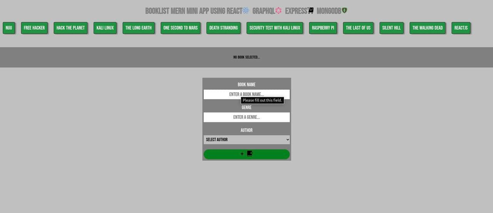
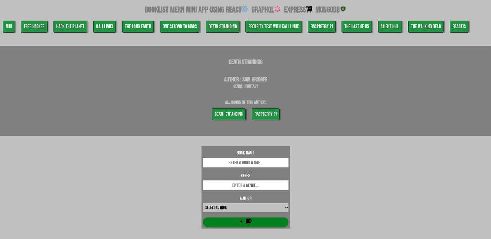

# book-list-fullstack-app-using-graphql-reactjs-expressjs-mongodb
# Heroku Link ==> https://booklist-mern-app.herokuapp.com/

#Nginx Server Deployment
#Edit the Nginx configuration
Deployment Frontend from main directory   ==> sudo cp -r client/build/* /var/www/html/
Deployment Backend   ==>
1- In main directory =>   sudo nano /etc/nginx/sites-available/default
2- Setting up =>
<!-- server {
        listen 80 default_server;
        listen [::]:80 default_server;

        root /var/www/html;
 
        index index.html index.htm index.nginx-debian.html;

        server_name _;

          location api/ {
            proxy_pass http://127.0.0.1:4001;
            }

        location / {
                try_files $uri $uri/ =404;
           }

        } -->
 3- sudo systemctl restart nginx 
 4- Go to backend path which is in this case server
 5- sudo cp -r ./* /var/www/server
 6- Check if its done ==> ls -la /var/www/server

# Systemd configuration
7- sudo nano /etc/systemd/system/server.service
8- Add this & save ==>

[Service]
Environment=PORT=4001
Type=simple
User=??????????????????????????
ExecStart=/usr/bin/node /var/www/server/app.js
Restart=on-failure

[Install]
WantedBy=multi-user.target

8- sudo systemctl daemon-reload
9- suso systemctl enable server
10- sudo systemctl start server
11- sudo systemctl restart nginx.service

https://ciamac-da.github.io/book-list-fullstack-app-using-graphql-reactjs-expressjs-mongodb/

 
 
